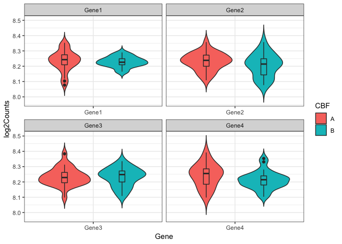
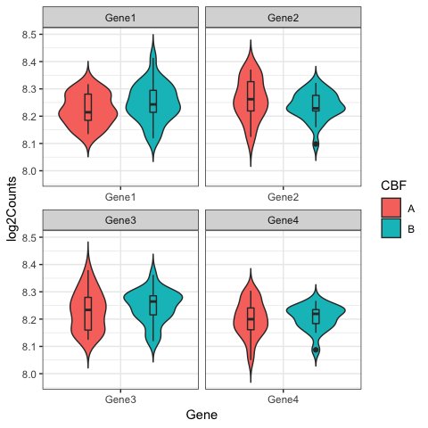
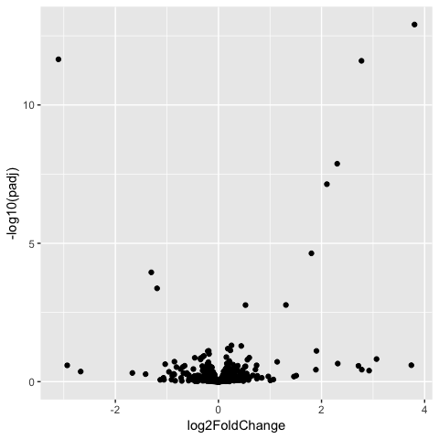
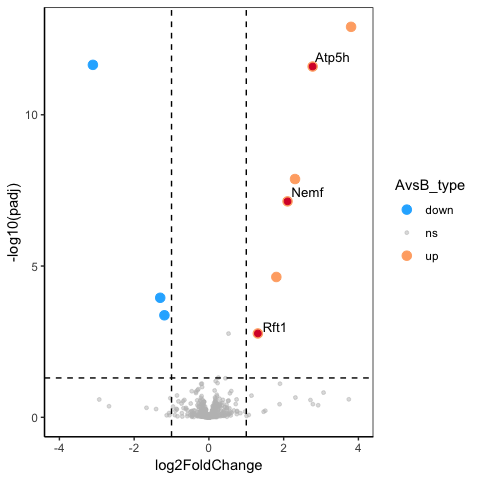
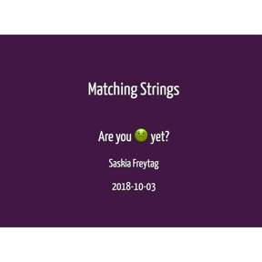
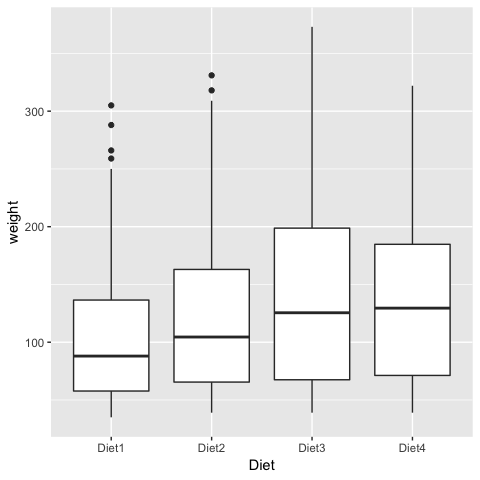
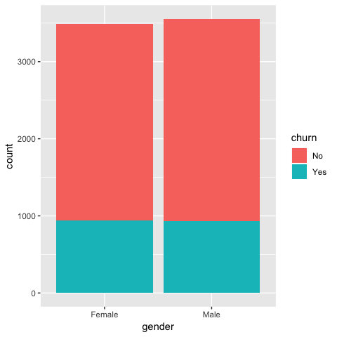
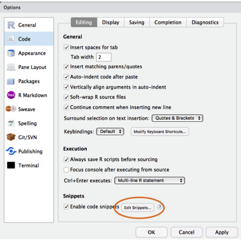
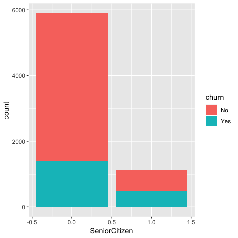
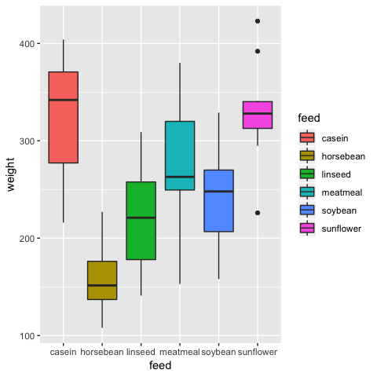

How R you? - R-Ladies Melbourne code and tips!
================
17/10/2018

-   [**R-Ladies Melbourne second anniversary**](#r-ladies-melbourne-second-anniversary)
-   [**Visualisation**](#visualisation)
    -   [Having fun with `base::plot()`!](#having-fun-with-baseplot)
    -   [Violin plots with overlayed boxplots and coloured by group: `position_dodge()`](#violin-plots-with-overlayed-boxplots-and-coloured-by-group-position_dodge)
    -   [`DT` package for interactive tables](#dt-package-for-interactive-tables)
    -   [Different ways of plotting your data with `ggplot()` using `geom_histogram()` and `geom_density_ridges()`](#different-ways-of-plotting-your-data-with-ggplot-using-geom_histogram-and-geom_density_ridges)
    -   [Data visualisation via volcano plots](#data-visualisation-via-volcano-plots)
    -   [Create multiple plots using for loop / Code Snippets](#create-multiple-plots-using-for-loop-code-snippets)
-   [**Dealing with strings and factors**](#dealing-with-strings-and-factors)
    -   [Matching strings](#matching-strings)
    -   [`library(forcats)`: the incredible things you can do with your `R` factors!](#libraryforcats-the-incredible-things-you-can-do-with-your-r-factors)
-   [**Data manipulation with `mutate_at()` and `summarise_at()`**](#data-manipulation-with-mutate_at-and-summarise_at)
    -   [Mutate](#mutate)
    -   [Summarise](#summarise)
-   [**Where to get help with your `R` question?**](#where-to-get-help-with-your-r-question)
-   [**How to get all the functions within a package**](#how-to-get-all-the-functions-within-a-package)
-   [**`sessionInfo()`**](#sessioninfo)


**R-Ladies Melbourne second anniversary**
=========================================

To celebrate our second birthday 🎂 we wanted to bring out the <!--html_preserve--><i class="fab  fa-r-project " style="color:blue;"></i><!--/html_preserve--> diversity of our community. That's why we asked to all our members and all the <!--html_preserve--><i class="fab  fa-r-project " style="color:purple;"></i><!--/html_preserve-->-Ladies Melbourne followers to send us their favourite R tip and share it in a 5 minutes presentation at our event. Below are all the beautiful tips that we managed to collect!

Have fun 😉!!

**Visualisation**
=================

Having fun with `base::plot()`!
-------------------------------

**Author**: Soroor Zadeh

``` r
par(bg="black")
plot( (-2)^as.complex( seq(0, 7, 0.03) ), pch=21, bg=c( 2,3), xlab="", ylab="", xaxt="n", yaxt="n")
text(-30, 40, "Happy Anniversary! \n R-Ladies Melbourne", cex=2,col="#88398A")
```



------------------------------------------------------------------------

Violin plots with overlayed boxplots and coloured by group: `position_dodge()`
------------------------------------------------------------------------------

**Author**: [Anna Quaglieri](https://github.com/annaquaglieri16)

Whenever I have to display to compare continuous variables this has become my favourite way to go! *Violin plot* + *boxplot* allows me to see both the quantiles and the overall density distribution that if can often be missed with only boxplots.

``` r
library(ggplot2)

data <- data.frame(Gene = rep(c("Gene1","Gene2","Gene3","Gene4"),each=46),
                   Counts = log2(rbinom(n = 46*4,size = 1000,prob = 0.3)),
                   CBF = sample(x = c("A","B"),size = 46*4,replace=TRUE))

dodge <- position_dodge(width = 1)
ggplot(data,aes(x=Gene,y=Counts,fill=CBF)) + theme_bw()  + theme(axis.text.x = element_text(angle = 0)) + geom_violin(trim=FALSE,position = dodge) + geom_boxplot(width=.1,position = dodge,show.legend = FALSE) +  labs(y="log2Counts") + facet_wrap(~Gene,scales="free_x")
```



------------------------------------------------------------------------

`DT` package for interactive tables
-----------------------------------

**Authors**: [Sepideh Foroutan](https://twitter.com/S_Foroutan)

``` r
library(DT)
library(reshape2) # to get the "tips" dataset

data("tips")

datatable(tips, filter = "top", options = list(pageLength = 8))  %>%   ## Bold some numbers:
  formatStyle('total_bill', 
    fontWeight = styleInterval(18, c('normal', 'bold'))) %>%  ## show colour bar
  formatStyle('tip', 
    background = styleColorBar(tips$tip, 'mediumpurple'),
    backgroundSize = '100% 95%',
    backgroundRepeat = 'no-repeat',
    backgroundPosition = 'centre') %>%   ## transform values
  formatStyle('sex', 
    transform = 'rotateX(-45deg) rotateY(-30deg) rotateZ(-50deg)',
    backgroundColor = styleEqual(unique(tips$sex), c('lightblue', 'lightseagreen'))) %>%  ## colour value/background
  formatStyle('size', 
    color = styleInterval(c(2, 4), c('blue', 'black', 'red')), 
    backgroundColor = styleInterval(c(2, 4), c('white', 'gray', 'gray50')))
```

<!--html_preserve-->

<script type="application/json" data-for="htmlwidget-da61ca2840aee6ae2047">{"x":{"filter":"top","filterHTML":"<tr>\n  <td><\/td>\n  <td data-type=\"number\" style=\"vertical-align: top;\">\n    <div class=\"form-group has-feedback\" style=\"margin-bottom: auto;\">\n      <input type=\"search\" placeholder=\"All\" class=\"form-control\" style=\"width: 100%;\"/>\n      <span class=\"glyphicon glyphicon-remove-circle form-control-feedback\"><\/span>\n    <\/div>\n    <div style=\"display: none; position: absolute; width: 200px;\">\n      <div data-min=\"3.07\" data-max=\"50.81\" data-scale=\"2\"><\/div>\n      <span style=\"float: left;\"><\/span>\n      <span style=\"float: right;\"><\/span>\n    <\/div>\n  <\/td>\n  <td data-type=\"number\" style=\"vertical-align: top;\">\n    <div class=\"form-group has-feedback\" style=\"margin-bottom: auto;\">\n      <input type=\"search\" placeholder=\"All\" class=\"form-control\" style=\"width: 100%;\"/>\n      <span class=\"glyphicon glyphicon-remove-circle form-control-feedback\"><\/span>\n    <\/div>\n    <div style=\"display: none; position: absolute; width: 200px;\">\n      <div data-min=\"1\" data-max=\"10\" data-scale=\"2\"><\/div>\n      <span style=\"float: left;\"><\/span>\n      <span style=\"float: right;\"><\/span>\n    <\/div>\n  <\/td>\n  <td data-type=\"factor\" style=\"vertical-align: top;\">\n    <div class=\"form-group has-feedback\" style=\"margin-bottom: auto;\">\n      <input type=\"search\" placeholder=\"All\" class=\"form-control\" style=\"width: 100%;\"/>\n      <span class=\"glyphicon glyphicon-remove-circle form-control-feedback\"><\/span>\n    <\/div>\n    <div style=\"width: 100%; display: none;\">\n      <select multiple=\"multiple\" style=\"width: 100%;\" data-options=\"[&quot;Female&quot;,&quot;Male&quot;]\"><\/select>\n    <\/div>\n  <\/td>\n  <td data-type=\"factor\" style=\"vertical-align: top;\">\n    <div class=\"form-group has-feedback\" style=\"margin-bottom: auto;\">\n      <input type=\"search\" placeholder=\"All\" class=\"form-control\" style=\"width: 100%;\"/>\n      <span class=\"glyphicon glyphicon-remove-circle form-control-feedback\"><\/span>\n    <\/div>\n    <div style=\"width: 100%; display: none;\">\n      <select multiple=\"multiple\" style=\"width: 100%;\" data-options=\"[&quot;No&quot;,&quot;Yes&quot;]\"><\/select>\n    <\/div>\n  <\/td>\n  <td data-type=\"factor\" style=\"vertical-align: top;\">\n    <div class=\"form-group has-feedback\" style=\"margin-bottom: auto;\">\n      <input type=\"search\" placeholder=\"All\" class=\"form-control\" style=\"width: 100%;\"/>\n      <span class=\"glyphicon glyphicon-remove-circle form-control-feedback\"><\/span>\n    <\/div>\n    <div style=\"width: 100%; display: none;\">\n      <select multiple=\"multiple\" style=\"width: 100%;\" data-options=\"[&quot;Fri&quot;,&quot;Sat&quot;,&quot;Sun&quot;,&quot;Thur&quot;]\"><\/select>\n    <\/div>\n  <\/td>\n  <td data-type=\"factor\" style=\"vertical-align: top;\">\n    <div class=\"form-group has-feedback\" style=\"margin-bottom: auto;\">\n      <input type=\"search\" placeholder=\"All\" class=\"form-control\" style=\"width: 100%;\"/>\n      <span class=\"glyphicon glyphicon-remove-circle form-control-feedback\"><\/span>\n    <\/div>\n    <div style=\"width: 100%; display: none;\">\n      <select multiple=\"multiple\" style=\"width: 100%;\" data-options=\"[&quot;Dinner&quot;,&quot;Lunch&quot;]\"><\/select>\n    <\/div>\n  <\/td>\n  <td data-type=\"integer\" style=\"vertical-align: top;\">\n    <div class=\"form-group has-feedback\" style=\"margin-bottom: auto;\">\n      <input type=\"search\" placeholder=\"All\" class=\"form-control\" style=\"width: 100%;\"/>\n      <span class=\"glyphicon glyphicon-remove-circle form-control-feedback\"><\/span>\n    <\/div>\n    <div style=\"display: none; position: absolute; width: 200px;\">\n      <div data-min=\"1\" data-max=\"6\"><\/div>\n      <span style=\"float: left;\"><\/span>\n      <span style=\"float: right;\"><\/span>\n    <\/div>\n  <\/td>\n<\/tr>","data":[["1","2","3","4","5","6","7","8","9","10","11","12","13","14","15","16","17","18","19","20","21","22","23","24","25","26","27","28","29","30","31","32","33","34","35","36","37","38","39","40","41","42","43","44","45","46","47","48","49","50","51","52","53","54","55","56","57","58","59","60","61","62","63","64","65","66","67","68","69","70","71","72","73","74","75","76","77","78","79","80","81","82","83","84","85","86","87","88","89","90","91","92","93","94","95","96","97","98","99","100","101","102","103","104","105","106","107","108","109","110","111","112","113","114","115","116","117","118","119","120","121","122","123","124","125","126","127","128","129","130","131","132","133","134","135","136","137","138","139","140","141","142","143","144","145","146","147","148","149","150","151","152","153","154","155","156","157","158","159","160","161","162","163","164","165","166","167","168","169","170","171","172","173","174","175","176","177","178","179","180","181","182","183","184","185","186","187","188","189","190","191","192","193","194","195","196","197","198","199","200","201","202","203","204","205","206","207","208","209","210","211","212","213","214","215","216","217","218","219","220","221","222","223","224","225","226","227","228","229","230","231","232","233","234","235","236","237","238","239","240","241","242","243","244"],[16.99,10.34,21.01,23.68,24.59,25.29,8.77,26.88,15.04,14.78,10.27,35.26,15.42,18.43,14.83,21.58,10.33,16.29,16.97,20.65,17.92,20.29,15.77,39.42,19.82,17.81,13.37,12.69,21.7,19.65,9.55,18.35,15.06,20.69,17.78,24.06,16.31,16.93,18.69,31.27,16.04,17.46,13.94,9.68,30.4,18.29,22.23,32.4,28.55,18.04,12.54,10.29,34.81,9.94,25.56,19.49,38.01,26.41,11.24,48.27,20.29,13.81,11.02,18.29,17.59,20.08,16.45,3.07,20.23,15.01,12.02,17.07,26.86,25.28,14.73,10.51,17.92,27.2,22.76,17.29,19.44,16.66,10.07,32.68,15.98,34.83,13.03,18.28,24.71,21.16,28.97,22.49,5.75,16.32,22.75,40.17,27.28,12.03,21.01,12.46,11.35,15.38,44.3,22.42,20.92,15.36,20.49,25.21,18.24,14.31,14,7.25,38.07,23.95,25.71,17.31,29.93,10.65,12.43,24.08,11.69,13.42,14.26,15.95,12.48,29.8,8.52,14.52,11.38,22.82,19.08,20.27,11.17,12.26,18.26,8.51,10.33,14.15,16,13.16,17.47,34.3,41.19,27.05,16.43,8.35,18.64,11.87,9.78,7.51,14.07,13.13,17.26,24.55,19.77,29.85,48.17,25,13.39,16.49,21.5,12.66,16.21,13.81,17.51,24.52,20.76,31.71,10.59,10.63,50.81,15.81,7.25,31.85,16.82,32.9,17.89,14.48,9.6,34.63,34.65,23.33,45.35,23.17,40.55,20.69,20.9,30.46,18.15,23.1,15.69,19.81,28.44,15.48,16.58,7.56,10.34,43.11,13,13.51,18.71,12.74,13,16.4,20.53,16.47,26.59,38.73,24.27,12.76,30.06,25.89,48.33,13.27,28.17,12.9,28.15,11.59,7.74,30.14,12.16,13.42,8.58,15.98,13.42,16.27,10.09,20.45,13.28,22.12,24.01,15.69,11.61,10.77,15.53,10.07,12.6,32.83,35.83,29.03,27.18,22.67,17.82,18.78],[1.01,1.66,3.5,3.31,3.61,4.71,2,3.12,1.96,3.23,1.71,5,1.57,3,3.02,3.92,1.67,3.71,3.5,3.35,4.08,2.75,2.23,7.58,3.18,2.34,2,2,4.3,3,1.45,2.5,3,2.45,3.27,3.6,2,3.07,2.31,5,2.24,2.54,3.06,1.32,5.6,3,5,6,2.05,3,2.5,2.6,5.2,1.56,4.34,3.51,3,1.5,1.76,6.73,3.21,2,1.98,3.76,2.64,3.15,2.47,1,2.01,2.09,1.97,3,3.14,5,2.2,1.25,3.08,4,3,2.71,3,3.4,1.83,5,2.03,5.17,2,4,5.85,3,3,3.5,1,4.3,3.25,4.73,4,1.5,3,1.5,2.5,3,2.5,3.48,4.08,1.64,4.06,4.29,3.76,4,3,1,4,2.55,4,3.5,5.07,1.5,1.8,2.92,2.31,1.68,2.5,2,2.52,4.2,1.48,2,2,2.18,1.5,2.83,1.5,2,3.25,1.25,2,2,2,2.75,3.5,6.7,5,5,2.3,1.5,1.36,1.63,1.73,2,2.5,2,2.74,2,2,5.14,5,3.75,2.61,2,3.5,2.5,2,2,3,3.48,2.24,4.5,1.61,2,10,3.16,5.15,3.18,4,3.11,2,2,4,3.55,3.68,5.65,3.5,6.5,3,5,3.5,2,3.5,4,1.5,4.19,2.56,2.02,4,1.44,2,5,2,2,4,2.01,2,2.5,4,3.23,3.41,3,2.03,2.23,2,5.16,9,2.5,6.5,1.1,3,1.5,1.44,3.09,2.2,3.48,1.92,3,1.58,2.5,2,3,2.72,2.88,2,3,3.39,1.47,3,1.25,1,1.17,4.67,5.92,2,2,1.75,3],["Female","Male","Male","Male","Female","Male","Male","Male","Male","Male","Male","Female","Male","Male","Female","Male","Female","Male","Female","Male","Male","Female","Female","Male","Male","Male","Male","Male","Male","Female","Male","Male","Female","Female","Male","Male","Male","Female","Male","Male","Male","Male","Male","Male","Male","Male","Male","Male","Male","Male","Male","Female","Female","Male","Male","Male","Male","Female","Male","Male","Male","Male","Male","Male","Male","Male","Female","Female","Male","Male","Male","Female","Female","Female","Female","Male","Male","Male","Male","Male","Male","Male","Female","Male","Male","Female","Male","Male","Male","Male","Male","Male","Female","Female","Female","Male","Male","Male","Male","Male","Female","Female","Female","Female","Female","Male","Male","Male","Male","Female","Male","Female","Male","Male","Female","Female","Male","Female","Female","Female","Male","Female","Male","Male","Female","Female","Male","Female","Female","Male","Male","Female","Female","Female","Female","Female","Female","Female","Male","Female","Female","Male","Male","Female","Female","Female","Female","Female","Male","Male","Male","Male","Male","Male","Male","Female","Male","Female","Female","Male","Male","Male","Female","Male","Female","Male","Male","Male","Female","Female","Male","Male","Male","Male","Male","Male","Male","Male","Female","Male","Male","Male","Male","Male","Male","Male","Female","Male","Female","Male","Male","Female","Male","Male","Male","Male","Male","Female","Female","Male","Male","Female","Female","Female","Male","Female","Male","Male","Male","Female","Male","Male","Male","Female","Female","Female","Male","Male","Male","Female","Male","Female","Male","Female","Male","Female","Female","Male","Male","Female","Male","Male","Male","Male","Male","Male","Male","Male","Female","Male","Female","Male","Male","Female"],["No","No","No","No","No","No","No","No","No","No","No","No","No","No","No","No","No","No","No","No","No","No","No","No","No","No","No","No","No","No","No","No","No","No","No","No","No","No","No","No","No","No","No","No","No","No","No","No","No","No","No","No","No","No","No","No","Yes","No","Yes","No","Yes","Yes","Yes","Yes","No","No","No","Yes","No","Yes","No","No","Yes","Yes","No","No","Yes","No","No","No","Yes","No","No","Yes","No","No","No","No","No","No","Yes","No","Yes","Yes","No","Yes","Yes","Yes","Yes","No","Yes","Yes","Yes","Yes","No","Yes","Yes","Yes","No","Yes","No","No","No","No","No","No","No","No","No","No","No","No","No","No","No","No","No","No","No","No","No","No","No","No","No","No","No","No","Yes","No","No","No","No","No","No","No","No","No","No","No","No","No","No","No","No","No","No","No","No","No","No","No","No","No","Yes","No","No","No","Yes","Yes","Yes","Yes","Yes","Yes","Yes","Yes","Yes","Yes","Yes","Yes","Yes","Yes","Yes","Yes","Yes","No","Yes","Yes","Yes","Yes","Yes","Yes","Yes","Yes","Yes","No","Yes","Yes","Yes","Yes","Yes","Yes","Yes","Yes","Yes","Yes","Yes","Yes","Yes","Yes","Yes","Yes","No","Yes","Yes","Yes","Yes","Yes","Yes","Yes","Yes","Yes","Yes","No","Yes","Yes","Yes","No","No","Yes","Yes","Yes","No","No","Yes","No","Yes","Yes","No","No","Yes","Yes","No","No"],["Sun","Sun","Sun","Sun","Sun","Sun","Sun","Sun","Sun","Sun","Sun","Sun","Sun","Sun","Sun","Sun","Sun","Sun","Sun","Sat","Sat","Sat","Sat","Sat","Sat","Sat","Sat","Sat","Sat","Sat","Sat","Sat","Sat","Sat","Sat","Sat","Sat","Sat","Sat","Sat","Sat","Sun","Sun","Sun","Sun","Sun","Sun","Sun","Sun","Sun","Sun","Sun","Sun","Sun","Sun","Sun","Sat","Sat","Sat","Sat","Sat","Sat","Sat","Sat","Sat","Sat","Sat","Sat","Sat","Sat","Sat","Sat","Sat","Sat","Sat","Sat","Sat","Thur","Thur","Thur","Thur","Thur","Thur","Thur","Thur","Thur","Thur","Thur","Thur","Thur","Fri","Fri","Fri","Fri","Fri","Fri","Fri","Fri","Fri","Fri","Fri","Fri","Sat","Sat","Sat","Sat","Sat","Sat","Sat","Sat","Sat","Sat","Sun","Sun","Sun","Sun","Sun","Thur","Thur","Thur","Thur","Thur","Thur","Thur","Thur","Thur","Thur","Thur","Thur","Thur","Thur","Thur","Thur","Thur","Thur","Thur","Thur","Thur","Thur","Thur","Thur","Thur","Thur","Thur","Thur","Thur","Thur","Thur","Thur","Thur","Sun","Sun","Sun","Sun","Sun","Sun","Sun","Sun","Sun","Sun","Sun","Sun","Sun","Sun","Sun","Sun","Sun","Sun","Sat","Sat","Sat","Sat","Sun","Sun","Sun","Sun","Sun","Sun","Sun","Sun","Sun","Sun","Sun","Sun","Sun","Sun","Sun","Sun","Sun","Sun","Sun","Thur","Thur","Thur","Thur","Thur","Thur","Thur","Thur","Thur","Thur","Thur","Thur","Thur","Thur","Thur","Sat","Sat","Sat","Sat","Sat","Sat","Sat","Sat","Sat","Sat","Sat","Sat","Sat","Sat","Fri","Fri","Fri","Fri","Fri","Fri","Fri","Sat","Sat","Sat","Sat","Sat","Sat","Sat","Sat","Sat","Sat","Sat","Sat","Sat","Sat","Sat","Sat","Thur"],["Dinner","Dinner","Dinner","Dinner","Dinner","Dinner","Dinner","Dinner","Dinner","Dinner","Dinner","Dinner","Dinner","Dinner","Dinner","Dinner","Dinner","Dinner","Dinner","Dinner","Dinner","Dinner","Dinner","Dinner","Dinner","Dinner","Dinner","Dinner","Dinner","Dinner","Dinner","Dinner","Dinner","Dinner","Dinner","Dinner","Dinner","Dinner","Dinner","Dinner","Dinner","Dinner","Dinner","Dinner","Dinner","Dinner","Dinner","Dinner","Dinner","Dinner","Dinner","Dinner","Dinner","Dinner","Dinner","Dinner","Dinner","Dinner","Dinner","Dinner","Dinner","Dinner","Dinner","Dinner","Dinner","Dinner","Dinner","Dinner","Dinner","Dinner","Dinner","Dinner","Dinner","Dinner","Dinner","Dinner","Dinner","Lunch","Lunch","Lunch","Lunch","Lunch","Lunch","Lunch","Lunch","Lunch","Lunch","Lunch","Lunch","Lunch","Dinner","Dinner","Dinner","Dinner","Dinner","Dinner","Dinner","Dinner","Dinner","Dinner","Dinner","Dinner","Dinner","Dinner","Dinner","Dinner","Dinner","Dinner","Dinner","Dinner","Dinner","Dinner","Dinner","Dinner","Dinner","Dinner","Dinner","Lunch","Lunch","Lunch","Lunch","Lunch","Lunch","Lunch","Lunch","Lunch","Lunch","Lunch","Lunch","Lunch","Lunch","Lunch","Lunch","Lunch","Lunch","Lunch","Lunch","Lunch","Lunch","Lunch","Lunch","Lunch","Lunch","Lunch","Lunch","Lunch","Lunch","Lunch","Lunch","Lunch","Dinner","Dinner","Dinner","Dinner","Dinner","Dinner","Dinner","Dinner","Dinner","Dinner","Dinner","Dinner","Dinner","Dinner","Dinner","Dinner","Dinner","Dinner","Dinner","Dinner","Dinner","Dinner","Dinner","Dinner","Dinner","Dinner","Dinner","Dinner","Dinner","Dinner","Dinner","Dinner","Dinner","Dinner","Dinner","Dinner","Dinner","Dinner","Dinner","Dinner","Dinner","Lunch","Lunch","Lunch","Lunch","Lunch","Lunch","Lunch","Lunch","Lunch","Lunch","Lunch","Lunch","Lunch","Lunch","Lunch","Dinner","Dinner","Dinner","Dinner","Dinner","Dinner","Dinner","Dinner","Dinner","Dinner","Dinner","Dinner","Dinner","Dinner","Lunch","Lunch","Lunch","Lunch","Lunch","Lunch","Lunch","Dinner","Dinner","Dinner","Dinner","Dinner","Dinner","Dinner","Dinner","Dinner","Dinner","Dinner","Dinner","Dinner","Dinner","Dinner","Dinner","Dinner"],[2,3,3,2,4,4,2,4,2,2,2,4,2,4,2,2,3,3,3,3,2,2,2,4,2,4,2,2,2,2,2,4,2,4,2,3,3,3,3,3,3,2,2,2,4,2,2,4,3,2,2,2,4,2,4,2,4,2,2,4,2,2,2,4,3,3,2,1,2,2,2,3,2,2,2,2,2,4,2,2,2,2,1,2,2,4,2,2,2,2,2,2,2,2,2,4,2,2,2,2,2,2,3,2,2,2,2,2,2,2,2,1,3,2,3,2,4,2,2,4,2,2,2,2,2,6,2,2,2,3,2,2,2,2,2,2,2,2,2,2,2,6,5,6,2,2,3,2,2,2,2,2,3,4,4,5,6,4,2,4,4,2,3,2,2,3,2,4,2,2,3,2,2,2,2,2,2,2,2,2,4,2,3,4,2,5,3,5,3,3,2,2,2,2,2,2,2,4,2,2,3,2,2,2,4,3,3,4,2,2,3,4,4,2,3,2,5,2,2,4,2,2,1,3,2,2,2,4,2,2,4,3,2,2,2,2,2,2,3,3,2,2,2,2]],"container":"<table class=\"display\">\n  <thead>\n    <tr>\n      <th> <\/th>\n      <th>total_bill<\/th>\n      <th>tip<\/th>\n      <th>sex<\/th>\n      <th>smoker<\/th>\n      <th>day<\/th>\n      <th>time<\/th>\n      <th>size<\/th>\n    <\/tr>\n  <\/thead>\n<\/table>","options":{"pageLength":8,"columnDefs":[{"className":"dt-right","targets":[1,2,7]},{"orderable":false,"targets":0}],"order":[],"autoWidth":false,"orderClasses":false,"orderCellsTop":true,"lengthMenu":[8,10,25,50,100],"rowCallback":"function(row, data) {\nvar value=data[7]; $(this.api().cell(row, 7).node()).css({'color':isNaN(parseFloat(value)) ? '' : value <= 2 ? 'blue' : value <= 4 ? 'black' : 'red','background-color':isNaN(parseFloat(value)) ? '' : value <= 2 ? 'white' : value <= 4 ? 'gray' : 'gray50'});\nvar value=data[3]; $(this.api().cell(row, 3).node()).css({'background-color':value == 'Female' ? 'lightblue' : value == 'Male' ? 'lightseagreen' : '','transform':'rotateX(-45deg) rotateY(-30deg) rotateZ(-50deg)'});\nvar value=data[2]; $(this.api().cell(row, 2).node()).css({'background':isNaN(parseFloat(value)) || value <= 1 ? '' : 'linear-gradient(90deg, transparent ' + (10 - value)/9 * 100 + '%, mediumpurple ' + (10 - value)/9 * 100 + '%)','background-size':'100% 95%','background-repeat':'no-repeat','background-position':'centre'});\nvar value=data[1]; $(this.api().cell(row, 1).node()).css({'font-weight':isNaN(parseFloat(value)) ? '' : value <= 18 ? 'normal' : 'bold'});\n}"}},"evals":["options.rowCallback"],"jsHooks":[]}</script>
<!--/html_preserve-->

------------------------------------------------------------------------

Different ways of plotting your data with `ggplot()` using `geom_histogram()` and `geom_density_ridges()`
---------------------------------------------------------------------------------------------------------

**Authors**: Marie Trussart

I used here ggd, which is a data frame extracted from clustering and expression datasets and that's how I define it:

`ggd <- melt(data.frame(cluster = cell_clustering, expr),id.vars = "cluster", value.name = "expression")`

``` r
### Density distributions
ggplot() +
geom_density_ridges(data = ggd, aes(x = expression, y = cluster), alpha = 0.3) +  scale_x_continuous(expand = c(0.01, 0)) +
scale_y_discrete(expand = c(0.01, 0))+
theme_ridges() +
theme(axis.text = element_text(size = 7),
strip.text = element_text(size = 7))
ggsave("Fig1.pdf")

## Histogram distribution by facet
ggplot(data = ggd, aes(x = expression)) + facet_wrap(~cluster, scales = 'free_y') +
geom_histogram()+
theme(strip.text.x = element_text(size=6),
        strip.text.y = element_text(size=6),
        axis.text = element_text( size = 8 ),
        axis.text.x = element_text( size = 8 ),
        axis.title = element_text( size = 8, face = "bold"))
ggsave("Fig2.pdf")

### All the histogram distributions on the same plot
ggplot(data =  ggd[grep("DG19", ggd$cluster),], aes(x = expression,fill=cluster))  +
geom_histogram()
ggsave("Fig3.pdf")
```


<p class="caption">
Figure 1. `geom_density_ridges()`
</p>


<p class="caption">
Figure 2. `geom_histogram()` and `facet_wrap()`
</p>


<p class="caption">
Figure 3. Another example of `geom_histogram() colouring by classes.`
</p>

------------------------------------------------------------------------

Data visualisation via volcano plots
------------------------------------

**Author**: [Erika Duan](https://github.com/erikaduan)

As a wet-lab immunologist, most of my job involves trying to **find** and then **illustrate** meaningful patterns from large biological datasets.

We obtain **a lot** of data from RNA sequencing experiments. These are experiments which look at how many mRNA molecules (i.e. message signals) are found in an object and how these signals differ in quantity across multiple objects.

We often analyse datasets with changes across &gt;10,000 signals between &gt;=2 different objects. A [volcano plot](https://en.wikipedia.org/wiki/Volcano_plot_(statistics)) is one way we visualise all statistically significant versus non-significant differences in one graph.

### A typical data analysis pipeline

1.  A large matrix is obtained, containing the number of signals 'counted' per signal type per object. Each row contains a unique signal ID (i.e. in my case a unique gene ID) and each column contains all the signal counts for one single object. *The researcher also has additional information about each object (i.e. object classification categories like object type, timepoint, batch etc.). This is very important for downstream RNAseq analysis, but not required for this analysis.*

2.  A minimal information threshold is set (i.e. minimal signal count per signal &gt; 1 for at least 1 object). **An awesome statistical package**, in my case `DESeq2` (<https://bioconductor.org/packages/release/bioc/html/DESeq2.html>), is then used to test whether any signals are differentially expressed between different objects.

3.  **Data visualisation** of all statistically **significant** versus **non-significant** signals between at least two objects, with the aim of highlighting any new or particularly interesting biological patterns.

Here, a **volcano plot** is used to depict:

-   how many signals are differentially expressed (using a statistical cut-off),
-   **and** by how much (i.e. signal fold change),
-   between two objects tested.

### Drawing volcano plots with `ggplot2`

A **results output file** can be created in `DESeq2` i.e. using `results(dds, contrast=c("Sample.type", "A", "B"))` and converted into a dataframe.

For convenience, I have provided a fake results output called `AvsB_results.csv` for use (i.e. a dataframe containing all signal differences between object A versus object B). Since we will be using both `dplyr` and `ggplot2`, I always find it more convenient to download the `tidyverse` package.

``` r
library("tidyverse")
library("ggrepel") # We will also need this package for the final labelling of data points. 
```

We start with our dataset of interest.

Note that for the volcano plot, you only need **three** columns of information:

1.  Gene symbol (aka unique signal ID)
2.  Log2(fold change) (aka how much the level of each signal in A differs from B by)
3.  Padj (the adjusted P-value or statistical likelihood for whether a signal in A is not different to that of B)

``` r
AvsB_results <- read.csv("How_R_You_R-LadiesMelbourne_code_and_tips_data/AvsB_results.csv", header = T, stringsAsFactors = F)
str(AvsB_results) # The dataframe contains the 3 columns of info described above. 
```

    ## 'data.frame':    600 obs. of  3 variables:
    ##  $ log2FoldChange: num  3.804 2.104 1.804 1.309 0.525 ...
    ##  $ padj          : num  1.24e-13 7.29e-08 2.30e-05 1.69e-03 1.71e-03 ...
    ##  $ Symbol        : chr  "Ep300" "Nemf" "Atad2b" "Rft1" ...

A simple volcano plot depicts:

-   Along its x-axis: log2(fold change)
-   Along its y-axis: -log10(padj)

Note that the y-axis is depicted as -log10(padj), which allows the data points (i.e. volcano spray) to project upwards as the absolute value along the x axis increases. Graphically, this is more intuitive to visualise.

``` r
simple_vp <- ggplot(AvsB_results, aes(x = log2FoldChange,
                         y = -log10(padj))) + 
  geom_point() # A simple volcano plot is created.

simple_vp
```



This plot is too plain as objects of interest do not easily jump out at us.
A good volcano plot will highlight all the signals (represented by individual data points) which are significantly different between A vs B.
In this case, we would be interested in highlighting genes which have a **padj &lt;= 0.05 (or a -log10(padj) &gt;= 1.30103)** (my chosen statitical cut-off). I would also be interested in highlighting genes which additionally have a log2 fold change &lt;= -1 or &gt;= 1 (i.e. signals which are at least 2-fold bigger or smaller in A vs B).

I can now define these quandrants using:

``` r
simple_vp + 
  geom_hline(yintercept = -log10(0.05), linetype = "dashed") + # horiztonal dashed line
  geom_vline(xintercept = c(-1,1), linetype = "dashed") # vertical dashed line
```


The top-left quadrant contains all signals that are significantly decreased in A vs B, and the top right quandrant contains genes that are significantly increased in A vs B. The remaining genes are not significantly different and hence much less interesting to me.

The next thing we can therefore do is to **highlight** these three different groups of signals.
To do this, I return to my original dataframe and use the `dplyr::mutate` function.

``` r
AvsB_results <- mutate(AvsB_results,
                       AvsB_type = ifelse(is.na(padj)|padj > 0.05|abs(log2FoldChange) < 1, "ns", 
                         ifelse(log2FoldChange <= -1, "down",
                                "up"))) # creates a new column called AvsB_type, with signals classified as "ns", "down" or "up"

group_by(AvsB_results, AvsB_type) %>%
  summarize(Counts = n()) # counts how many signals are present in each category
```

    ## # A tibble: 3 x 2
    ##   AvsB_type Counts
    ##   <chr>      <int>
    ## 1 down           3
    ## 2 ns           591
    ## 3 up             6

Now that AvsB\_type can segregate each signal based on whether it is 'up', 'down' or 'ns' (i.e. non-significant), I can colour these three signal types differently (and/or change their size/transparency to make different points stand out more versus less).

``` r
cols <- c("up" = "#ffad73", "down" = "#26b3ff", "ns" = "grey") 
sizes <- c("up" = 3, "down" = 3, "ns" = 1) 
alphas <- c("up" = 1, "down" = 1, "ns" = 0.5)

ggplot(AvsB_results, aes(x = log2FoldChange,
                         y = -log10(padj))) +
  geom_point(aes(colour = AvsB_type, #specify point colour by AvsB_type
                 size = AvsB_type, #specify point size by AvsB_type
                 alpha = AvsB_type)) + #specify point transparency by AvsB_type
  scale_color_manual(values = cols) +
  scale_size_manual(values = sizes) +
  scale_alpha_manual(values = alphas) +
  geom_hline(yintercept = -log10(0.05), linetype = "dashed") + 
  geom_vline(xintercept = c(-1,1), linetype = "dashed") 
```


This is great! But there is still one final nifty trick!

As a biologist, I often get &gt;100s of genes which are significantly increased or decreased between two objects. To examine whether **interesting patterns (interconnected signals)** exist within these 100 genes, I run them through gene over-representation databases like [this one](http://software.broadinstitute.org/gsea/msigdb/index.jsp).

``` r
Interesting_pathway <- c("Nemf", "Rft1", "Atp5h") # An external database identifies an interesting signal network!
```

We would like to highlight these particular signals, by representing them in a different (darker) colour and also by labelling each individual point of interest.

``` r
ggplot(AvsB_results, aes(x = log2FoldChange,
                         y = -log10(padj))) +
  geom_point(aes(colour = AvsB_type,
                 size = AvsB_type,
                 alpha = AvsB_type)) +
  scale_color_manual(values = cols) +
  scale_size_manual(values = sizes) +
  scale_alpha_manual(values = alphas) +
  scale_x_continuous(limits = c(-4, 4)) + # changing the x-axis to make my volcano plot symmetrical
  geom_hline(yintercept = -log10(0.05), linetype = "dashed") + 
  geom_vline(xintercept = c(-1,1), linetype = "dashed") +
  geom_text_repel(data = AvsB_results %>% 
                    filter(Symbol %in% Interesting_pathway), # labels only genes in the interesting pathway
                  aes(label = Symbol),
                  size = 3.5,
                  color = "black",
                  nudge_x = 0.3, nudge_y = 0.1) + 
  geom_point(data = AvsB_results %>%
               filter(Symbol %in% Interesting_pathway), # adds new points for only genes in the interesting pathway
             color = "#d91933",
             size = 2) +
  theme_classic() + # creates a white background
  theme(panel.border = element_rect(colour = "black", fill=NA, size= 0.5)) # creates a plot border
```



Viola! Enjoy your volcano plot (and remember, there are lots of graphical modifiers you can use to visualise data using them, as long as your methods are logical and reasonable)!

### Development notes

**Chuanxin Liu** devised the elegant strategy for labelling all signal types as 'up', 'ns' or 'down' and the code for the labelling of specific signal data points.

### Other resources

<http://www.bioconductor.org/packages/devel/bioc/vignettes/DESeq2/inst/doc/DESeq2.html>

<http://www.sthda.com/english/wiki/ggplot2-texts-add-text-annotations-to-a-graph-in-r-software>

<http://www.sthda.com/english/wiki/ggplot2-axis-scales-and-transformations#change-x-and-y-axis-limits>

------------------------------------------------------------------------

Create multiple plots using for loop / Code Snippets
----------------------------------------------------

**Author**: Ivy Lin

Have a look at Ivy's R tip published on RPubs <http://rpubs.com/IvyLin/R-tips>.

------------------------------------------------------------------------

**Dealing with strings and factors**
====================================

Matching strings
----------------

**Author**: [Saskia Freytag](https://github.com/SaskiaFreytag)

Find Saskia's fabulous slides about all the ways to match strings in R [here](https://matchingstrings.netlify.com/#1).



------------------------------------------------------------------------

`library(forcats)`: the incredible things you can do with your `R` factors!
---------------------------------------------------------------------------

**Author**: [Anna Quaglieri](https://github.com/annaquaglieri16)

``` r
library(forcats)
library(datasets.load)
library(dplyr)
library(ggplot2)


kable(head(ChickWeight))
```

|  weight|  Time| Chick | Diet |
|-------:|-----:|:------|:-----|
|      42|     0| 1     | 1    |
|      51|     2| 1     | 1    |
|      59|     4| 1     | 1    |
|      64|     6| 1     | 1    |
|      76|     8| 1     | 1    |
|      93|    10| 1     | 1    |

``` r
# Let's make diet a factor
ChickWeight$Diet <- factor(ChickWeight$Diet,levels=c(1,2,3,4),labels = c("Diet1","Diet2","Diet3","Diet4"))
```

-   Default factor ordering: alphabetical ordering

``` r
table(ChickWeight$Diet)
```

    ## 
    ## Diet1 Diet2 Diet3 Diet4 
    ##   220   120   120   118

``` r
ChickWeight %>% 
ggplot(aes(x=Diet,y=weight)) + geom_boxplot() 
```



-   `forcats::fct_relevel`: reorder manually

``` r
ChickWeight %>% 
  mutate(Diet = fct_relevel(Diet,"Diet2","Diet3","Diet1","Diet4")) %>%
ggplot(aes(x=Diet,y=weight)) + geom_boxplot() 
```



-   `forcats::fct_infreq`: reorder by factor frequency

``` r
# let's sample out some rows
sample_chick <- ChickWeight[sample(nrow(ChickWeight),size=100),]

table(sample_chick$Diet)
```

    ## 
    ## Diet1 Diet2 Diet3 Diet4 
    ##    41    21    24    14

``` r
sample_chick %>% 
  ggplot(aes(x=Diet)) + geom_bar() 
```



``` r
table(fct_infreq(sample_chick$Diet))
```

    ## 
    ## Diet1 Diet3 Diet2 Diet4 
    ##    41    24    21    14

``` r
sample_chick %>% 
  mutate(Diet = fct_infreq(Diet)) %>%
ggplot(aes(x=Diet)) + geom_bar() 
```



-   `forcats::fct_reorder`: reorder by values of another variable

``` r
# chickwts  Chicken Weights by Feed Type
kable(head(chickwts))
```

|  weight| feed      |
|-------:|:----------|
|     179| horsebean |
|     160| horsebean |
|     136| horsebean |
|     227| horsebean |
|     217| horsebean |
|     168| horsebean |

``` r
class(chickwts$feed)
```

    ## [1] "factor"

``` r
chickwts %>% 
  ggplot(aes(x=feed,y=weight,fill=feed)) + geom_boxplot() 
```



``` r
chickwts %>% 
  mutate(feed = fct_reorder(feed,weight)) %>%
  ggplot(aes(x=feed,y=weight,fill=feed)) + geom_boxplot() 
```


------------------------------------------------------------------------

**Data manipulation with `mutate_at()` and `summarise_at()`**
=============================================================

**Author**: [Lucy Liu](https://twitter.com/lucyleeow)

A few weeks ago I learnt about `mutate_at()` and `summarise_at()`.

Mutate
------

The well known `mutate()` lets you do something like this:

``` r
# load package
library(tidyverse)
```

``` r
iris %>%
  mutate(newcol = Sepal.Length * 10) %>%
  head()
```

    ##   Sepal.Length Sepal.Width Petal.Length Petal.Width Species newcol
    ## 1          5.1         3.5          1.4         0.2  setosa     51
    ## 2          4.9         3.0          1.4         0.2  setosa     49
    ## 3          4.7         3.2          1.3         0.2  setosa     47
    ## 4          4.6         3.1          1.5         0.2  setosa     46
    ## 5          5.0         3.6          1.4         0.2  setosa     50
    ## 6          5.4         3.9          1.7         0.4  setosa     54

`mutate_at()` is used to perform a function on several columns at once. The syntax goes like this:

-   Tell it which columns you want to 'transform'. You can use `vars()` to do this. `vars()` understands the same specifications as `select()` e.g. `-c(col)`, `starts_with()`, `contains()`.
-   Tell it the function you want to perform.

When you only want to perform 1 function, you can get it to just replace the old columns:

``` r
iris %>%
  mutate_at(vars(starts_with("Petal")), log) %>%
  head()
```

    ##   Sepal.Length Sepal.Width Petal.Length Petal.Width Species
    ## 1          5.1         3.5    0.3364722  -1.6094379  setosa
    ## 2          4.9         3.0    0.3364722  -1.6094379  setosa
    ## 3          4.7         3.2    0.2623643  -1.6094379  setosa
    ## 4          4.6         3.1    0.4054651  -1.6094379  setosa
    ## 5          5.0         3.6    0.3364722  -1.6094379  setosa
    ## 6          5.4         3.9    0.5306283  -0.9162907  setosa

Here the columns Petal.Length and Petal.Width are now logs of the old columns.

If instead you wanted to add new columns to the end, use `funs()`:

``` r
iris %>%
  mutate_at(vars(starts_with("Petal")), 
            funs(log = log(.))) %>%
  head()
```

    ##   Sepal.Length Sepal.Width Petal.Length Petal.Width Species
    ## 1          5.1         3.5          1.4         0.2  setosa
    ## 2          4.9         3.0          1.4         0.2  setosa
    ## 3          4.7         3.2          1.3         0.2  setosa
    ## 4          4.6         3.1          1.5         0.2  setosa
    ## 5          5.0         3.6          1.4         0.2  setosa
    ## 6          5.4         3.9          1.7         0.4  setosa
    ##   Petal.Length_log Petal.Width_log
    ## 1        0.3364722      -1.6094379
    ## 2        0.3364722      -1.6094379
    ## 3        0.2623643      -1.6094379
    ## 4        0.4054651      -1.6094379
    ## 5        0.3364722      -1.6094379
    ## 6        0.5306283      -0.9162907

Note that we now need to use the `.` notation. This just means the data in the column selected.

You can also perform several functions:

``` r
iris %>%
  mutate_at(vars("Petal.Width"), funs(
    norm = ./mean(.),
    log = log(.)
  )) %>%
  head()
```

    ##   Sepal.Length Sepal.Width Petal.Length Petal.Width Species      norm
    ## 1          5.1         3.5          1.4         0.2  setosa 0.1667593
    ## 2          4.9         3.0          1.4         0.2  setosa 0.1667593
    ## 3          4.7         3.2          1.3         0.2  setosa 0.1667593
    ## 4          4.6         3.1          1.5         0.2  setosa 0.1667593
    ## 5          5.0         3.6          1.4         0.2  setosa 0.1667593
    ## 6          5.4         3.9          1.7         0.4  setosa 0.3335186
    ##          log
    ## 1 -1.6094379
    ## 2 -1.6094379
    ## 3 -1.6094379
    ## 4 -1.6094379
    ## 5 -1.6094379
    ## 6 -0.9162907

Summarise
---------

`summarise_at()` works similarly:

``` r
iris %>%
  group_by(Species) %>%
  summarise_at(vars(starts_with("Petal")), 
               funs(mean = mean(.),
                    median = median(.),
                    sd = sd(.)))
```

    ## # A tibble: 3 x 7
    ##   Species Petal.Length_me… Petal.Width_mean Petal.Length_me…
    ##   <fct>              <dbl>            <dbl>            <dbl>
    ## 1 setosa              1.46            0.246             1.5 
    ## 2 versic…             4.26            1.33              4.35
    ## 3 virgin…             5.55            2.03              5.55
    ## # ... with 3 more variables: Petal.Width_median <dbl>,
    ## #   Petal.Length_sd <dbl>, Petal.Width_sd <dbl>

You select columns using `vars()` and use `funs()` to tell it what function you want to perform.

------------------------------------------------------------------------

**Where to get help with your `R` question?**
=============================================

**Author**: [Maëlle Salmon](https://masalmon.eu/)

"Imagine you have an `R` question..." Check out Maëlle super comprehensive blog post [Where to get help with your `R` question?](https://masalmon.eu/2018/07/22/wheretogethelp/) about how to make your search the most efficient and targeted possible!

------------------------------------------------------------------------

**How to get all the functions within a package**
=================================================

**Author**: [Emi Tanaka](http://github.com/emitanaka)

Below you can find all the functions in `dplyr` (minus the internal hidden ones). There are in total 245 functions in `dplyr`.

``` r
library(dplyr)
ls("package:dplyr")
```

    ##   [1] "%>%"                "add_count"          "add_count_"        
    ##   [4] "add_row"            "add_rownames"       "add_tally"         
    ##   [7] "add_tally_"         "all_equal"          "all_vars"          
    ##  [10] "anti_join"          "any_vars"           "arrange"           
    ##  [13] "arrange_"           "arrange_all"        "arrange_at"        
    ##  [16] "arrange_if"         "as_data_frame"      "as_tibble"         
    ##  [19] "as.tbl"             "as.tbl_cube"        "auto_copy"         
    ##  [22] "band_instruments"   "band_instruments2"  "band_members"      
    ##  [25] "bench_tbls"         "between"            "bind_cols"         
    ##  [28] "bind_rows"          "case_when"          "changes"           
    ##  [31] "check_dbplyr"       "coalesce"           "collapse"          
    ##  [34] "collect"            "combine"            "common_by"         
    ##  [37] "compare_tbls"       "compare_tbls2"      "compute"           
    ##  [40] "contains"           "copy_to"            "count"             
    ##  [43] "count_"             "cumall"             "cumany"            
    ##  [46] "cume_dist"          "cummean"            "current_vars"      
    ##  [49] "data_frame"         "data_frame_"        "db_analyze"        
    ##  [52] "db_begin"           "db_commit"          "db_create_index"   
    ##  [55] "db_create_indexes"  "db_create_table"    "db_data_type"      
    ##  [58] "db_desc"            "db_drop_table"      "db_explain"        
    ##  [61] "db_has_table"       "db_insert_into"     "db_list_tables"    
    ##  [64] "db_query_fields"    "db_query_rows"      "db_rollback"       
    ##  [67] "db_save_query"      "db_write_table"     "dense_rank"        
    ##  [70] "desc"               "dim_desc"           "distinct"          
    ##  [73] "distinct_"          "do"                 "do_"               
    ##  [76] "dr_dplyr"           "ends_with"          "enexpr"            
    ##  [79] "enexprs"            "enquo"              "enquos"            
    ##  [82] "ensym"              "ensyms"             "eval_tbls"         
    ##  [85] "eval_tbls2"         "everything"         "explain"           
    ##  [88] "expr"               "failwith"           "filter"            
    ##  [91] "filter_"            "filter_all"         "filter_at"         
    ##  [94] "filter_if"          "first"              "frame_data"        
    ##  [97] "full_join"          "funs"               "funs_"             
    ## [100] "glimpse"            "group_by"           "group_by_"         
    ## [103] "group_by_all"       "group_by_at"        "group_by_if"       
    ## [106] "group_by_prepare"   "group_indices"      "group_indices_"    
    ## [109] "group_size"         "group_vars"         "grouped_df"        
    ## [112] "groups"             "id"                 "ident"             
    ## [115] "if_else"            "inner_join"         "intersect"         
    ## [118] "is_grouped_df"      "is.grouped_df"      "is.src"            
    ## [121] "is.tbl"             "lag"                "last"              
    ## [124] "lead"               "left_join"          "location"          
    ## [127] "lst"                "lst_"               "make_tbl"          
    ## [130] "matches"            "min_rank"           "mutate"            
    ## [133] "mutate_"            "mutate_all"         "mutate_at"         
    ## [136] "mutate_each"        "mutate_each_"       "mutate_if"         
    ## [139] "n"                  "n_distinct"         "n_groups"          
    ## [142] "na_if"              "nasa"               "near"              
    ## [145] "nth"                "ntile"              "num_range"         
    ## [148] "one_of"             "order_by"           "percent_rank"      
    ## [151] "progress_estimated" "pull"               "quo"               
    ## [154] "quo_name"           "quos"               "rbind_all"         
    ## [157] "rbind_list"         "recode"             "recode_factor"     
    ## [160] "rename"             "rename_"            "rename_all"        
    ## [163] "rename_at"          "rename_if"          "rename_vars"       
    ## [166] "rename_vars_"       "right_join"         "row_number"        
    ## [169] "rowwise"            "same_src"           "sample_frac"       
    ## [172] "sample_n"           "select"             "select_"           
    ## [175] "select_all"         "select_at"          "select_if"         
    ## [178] "select_var"         "select_vars"        "select_vars_"      
    ## [181] "semi_join"          "setdiff"            "setequal"          
    ## [184] "show_query"         "slice"              "slice_"            
    ## [187] "sql"                "sql_escape_ident"   "sql_escape_string" 
    ## [190] "sql_join"           "sql_select"         "sql_semi_join"     
    ## [193] "sql_set_op"         "sql_subquery"       "sql_translate_env" 
    ## [196] "src"                "src_df"             "src_local"         
    ## [199] "src_mysql"          "src_postgres"       "src_sqlite"        
    ## [202] "src_tbls"           "starts_with"        "starwars"          
    ## [205] "storms"             "summarise"          "summarise_"        
    ## [208] "summarise_all"      "summarise_at"       "summarise_each"    
    ## [211] "summarise_each_"    "summarise_if"       "summarize"         
    ## [214] "summarize_"         "summarize_all"      "summarize_at"      
    ## [217] "summarize_each"     "summarize_each_"    "summarize_if"      
    ## [220] "sym"                "syms"               "tally"             
    ## [223] "tally_"             "tbl"                "tbl_cube"          
    ## [226] "tbl_df"             "tbl_nongroup_vars"  "tbl_sum"           
    ## [229] "tbl_vars"           "tibble"             "top_n"             
    ## [232] "transmute"          "transmute_"         "transmute_all"     
    ## [235] "transmute_at"       "transmute_if"       "tribble"           
    ## [238] "trunc_mat"          "type_sum"           "ungroup"           
    ## [241] "union"              "union_all"          "vars"              
    ## [244] "with_order"         "wrap_dbplyr_obj"

------------------------------------------------------------------------

**`sessionInfo()`**
===================

``` r
sessionInfo()
```

    ## R version 3.5.1 (2018-07-02)
    ## Platform: x86_64-apple-darwin15.6.0 (64-bit)
    ## Running under: macOS Sierra 10.12.6
    ## 
    ## Matrix products: default
    ## BLAS: /Library/Frameworks/R.framework/Versions/3.5/Resources/lib/libRblas.0.dylib
    ## LAPACK: /Library/Frameworks/R.framework/Versions/3.5/Resources/lib/libRlapack.dylib
    ## 
    ## locale:
    ## [1] en_AU.UTF-8/en_AU.UTF-8/en_AU.UTF-8/C/en_AU.UTF-8/en_AU.UTF-8
    ## 
    ## attached base packages:
    ## [1] grid      stats     graphics  grDevices utils     datasets  methods  
    ## [8] base     
    ## 
    ## other attached packages:
    ##  [1] datasets.load_0.3.0 bindrcpp_0.2.2      ggrepel_0.8.0      
    ##  [4] forcats_0.3.0       stringr_1.3.1       dplyr_0.7.6        
    ##  [7] purrr_0.2.5         readr_1.1.1         tidyr_0.8.1        
    ## [10] tibble_1.4.2        tidyverse_1.2.1     reshape2_1.4.3     
    ## [13] DT_0.4              ggplot2_3.0.0       knitr_1.20         
    ## [16] icon_0.1.0          emo_0.0.0.9000      png_0.1-7          
    ## [19] magick_1.9         
    ## 
    ## loaded via a namespace (and not attached):
    ##  [1] Rcpp_0.12.18     lubridate_1.7.4  lattice_0.20-35  utf8_1.1.4      
    ##  [5] assertthat_0.2.0 rprojroot_1.3-2  digest_0.6.15    mime_0.5        
    ##  [9] R6_2.2.2         cellranger_1.1.0 plyr_1.8.4       backports_1.1.2 
    ## [13] evaluate_0.11    highr_0.7        httr_1.3.1       pillar_1.3.0    
    ## [17] rlang_0.2.2      lazyeval_0.2.1   readxl_1.1.0     miniUI_0.1.1.1  
    ## [21] rstudioapi_0.7   rmarkdown_1.10   labeling_0.3     htmlwidgets_1.2 
    ## [25] munsell_0.5.0    shiny_1.1.0      broom_0.5.0      compiler_3.5.1  
    ## [29] httpuv_1.4.5     modelr_0.1.2     pkgconfig_2.0.2  htmltools_0.3.6 
    ## [33] tidyselect_0.2.4 fansi_0.3.0      crayon_1.3.4     withr_2.1.2     
    ## [37] later_0.7.3      nlme_3.1-137     jsonlite_1.5     xtable_1.8-2    
    ## [41] gtable_0.2.0     magrittr_1.5     scales_1.0.0     cli_1.0.0       
    ## [45] stringi_1.2.4    promises_1.0.1   xml2_1.2.0       tools_3.5.1     
    ## [49] glue_1.3.0       hms_0.4.2        crosstalk_1.0.0  yaml_2.2.0      
    ## [53] colorspace_1.3-2 rvest_0.3.2      bindr_0.1.1      haven_1.1.2
