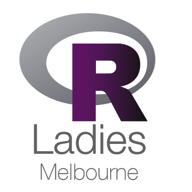

-   [How R you? - Lightning talks from the community](#how-r-you---lightning-talks-from-the-community)
    -   [How to submit your piece of R: [submit here](https://goo.gl/forms/9aMM5V7aT5X4A41x1)](#how-to-submit-your-piece-of-r-submit-here)
-   [Panel discussion with past speakers](#panel-discussion-with-past-speakers)

How R you? - Lightning talks from the community
-----------------------------------------------

To celebrate <!--html_preserve--><i class="fas  fa-birthday-cake " style="color:#88398A;"></i><!--/html_preserve--> our two years annive<!--html_preserve--><i class="fab  fa-r-project " style="color:#88398A;"></i><!--/html_preserve-->sary we will do something a little bit different! We would like to bring out the <!--html_preserve--><i class="fab  fa-r-project " style="color:#88398A;"></i><!--/html_preserve--> diversity of our community and for this we would like you to share with us your favourite piece of R. This can be an <!--html_preserve--><i class="fab  fa-r-project " style="color:#88398A;"></i><!--/html_preserve-->/<!--html_preserve--><i class="fab  fa-r-project " style="color:#88398A;"></i><!--/html_preserve--> Studio function or functionality; a way to build a model or to visualise your data that you use in your workflow or that simply you really like <!--html_preserve--><i class="fas  fa-heart " style="color:#88398A;"></i><!--/html_preserve-->; your favourite <!--html_preserve--><i class="fab  fa-r-project " style="color:#88398A;"></i><!--/html_preserve--> moment or tips from our events! It can be really anything about <!--html_preserve--><i class="fab  fa-r-project " style="color:#88398A;"></i><!--/html_preserve--> that you love and you can share with us in a few lines of code and present it at our event in 5 minutes. You can also add something about yourself if you’d like.

This will be a great opportunity to know more about how we all <!--html_preserve--><i class="fab  fa-r-project " style="color:#88398A;"></i><!--/html_preserve--> and what we love about and use <!--html_preserve--><i class="fab  fa-r-project " style="color:#88398A;"></i><!--/html_preserve--> for!

Depending on the number of submission we will decide how many lightning talks to showcase on the night and in case someone won’t be able to present we will anyway create an `Rmarkdown` repository with all the R-Ladies Melbourne tips!

### How to submit your piece of R: [submit here](https://goo.gl/forms/9aMM5V7aT5X4A41x1)

Send us something that you love about <!--html_preserve--><i class="fab  fa-r-project " style="color:#88398A;"></i><!--/html_preserve--> in one slide, one `R`/`Rmd` script or anything that works for you! Submit your [piece of <!--html_preserve--><i class="fab  fa-r-project " style="color:#88398A;"></i><!--/html_preserve--> here](https://goo.gl/forms/9aMM5V7aT5X4A41x1).

On the night you will:

1.  Share it in with everyone at our event in a five minutes presentation!
2.  We will draft two lucky winners among the presenter to win an amazing price!!
3.  We will combine all the R-Ladies tips that we received in one `Rmarkdown` `R-LadiesMelbourneRTips.Rmd` and make it available to everyone!

Panel discussion with past speakers
-----------------------------------

Following the lightning <!--html_preserve--><i class="fas  fa-bolt " style="color:#88398A;"></i><!--/html_preserve--> talks we will be entertained by a panel discussion featuring some of our past speakers and other <!--html_preserve--><i class="fab  fa-r-project " style="color:#88398A;"></i><!--/html_preserve--> experts from industry and academia. The discussion will start around their <!--html_preserve--><i class="fab  fa-r-project " style="color:#88398A;"></i><!--/html_preserve--> experience, their work as well their experience in public speaking and in sharing their interests with the broader community. You will have the opportunity to ask any question you would like!
