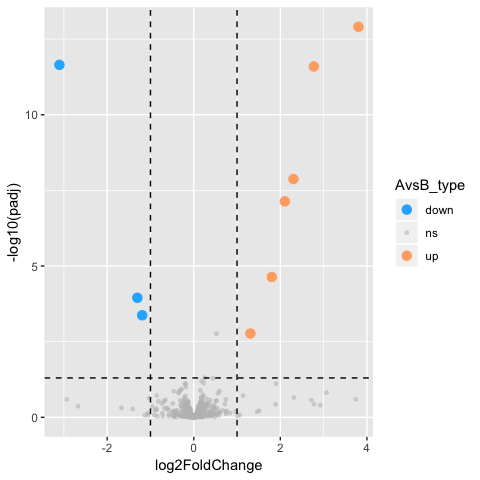
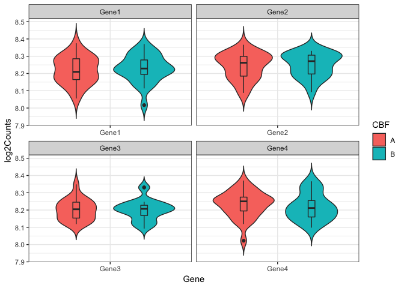

How R you? - R-Ladies Melbourne code and tips!
================
01/10/2018

-   [Matching strings](#matching-strings)
-   [DT package for interactive tables](#dt-package-for-interactive-tables)
-   [Using `pheatmap` to visualise the structure of your data](#using-pheatmap-to-visualise-the-structure-of-your-data)
    -   [See the final result!](#see-the-final-result)
    -   [Useful links to know more about heatmaps in R](#useful-links-to-know-more-about-heatmaps-in-r)
-   [Violin plots with overlayed boxplots and coloured by group](#violin-plots-with-overlayed-boxplots-and-coloured-by-group)
-   [Session Infos](#session-infos)


Matching strings
================

**Author**: [Saskia Freytag](https://github.com/SaskiaFreytag)

Find Saskia's fabulous slides about all the ways to match strings in R [here](https://matchingstrings.netlify.com/#1).


DT package for interactive tables
=================================

``` r
library(DT)
library(reshape2) # to get the "tips" dataset

data("tips")

datatable(tips, filter = "top", options = list(pageLength = 8))  %>%   ## Bold some numbers:
  formatStyle('total_bill', 
    fontWeight = styleInterval(18, c('normal', 'bold'))) %>%  ## show colour bar
  formatStyle('tip', 
    background = styleColorBar(tips$tip, 'mediumpurple'),
    backgroundSize = '100% 95%',
    backgroundRepeat = 'no-repeat',
    backgroundPosition = 'centre') %>%   ## transform values
  formatStyle('sex', 
    transform = 'rotateX(-45deg) rotateY(-30deg) rotateZ(-50deg)',
    backgroundColor = styleEqual(unique(tips$sex), c('lightblue', 'lightseagreen'))) %>%  ## colour value/background
  formatStyle('size', 
    color = styleInterval(c(2, 4), c('blue', 'black', 'red')), 
    backgroundColor = styleInterval(c(2, 4), c('white', 'gray', 'gray50')))
```

<!--html_preserve-->

<script type="application/json" data-for="htmlwidget-f5b788646754aecff59d">{"x":{"filter":"top","filterHTML":"<tr>\n  <td><\/td>\n  <td data-type=\"number\" style=\"vertical-align: top;\">\n    <div class=\"form-group has-feedback\" style=\"margin-bottom: auto;\">\n      <input type=\"search\" placeholder=\"All\" class=\"form-control\" style=\"width: 100%;\"/>\n      <span class=\"glyphicon glyphicon-remove-circle form-control-feedback\"><\/span>\n    <\/div>\n    <div style=\"display: none; position: absolute; width: 200px;\">\n      <div data-min=\"3.07\" data-max=\"50.81\" data-scale=\"2\"><\/div>\n      <span style=\"float: left;\"><\/span>\n      <span style=\"float: right;\"><\/span>\n    <\/div>\n  <\/td>\n  <td data-type=\"number\" style=\"vertical-align: top;\">\n    <div class=\"form-group has-feedback\" style=\"margin-bottom: auto;\">\n      <input type=\"search\" placeholder=\"All\" class=\"form-control\" style=\"width: 100%;\"/>\n      <span class=\"glyphicon glyphicon-remove-circle form-control-feedback\"><\/span>\n    <\/div>\n    <div style=\"display: none; position: absolute; width: 200px;\">\n      <div data-min=\"1\" data-max=\"10\" data-scale=\"2\"><\/div>\n      <span style=\"float: left;\"><\/span>\n      <span style=\"float: right;\"><\/span>\n    <\/div>\n  <\/td>\n  <td data-type=\"factor\" style=\"vertical-align: top;\">\n    <div class=\"form-group has-feedback\" style=\"margin-bottom: auto;\">\n      <input type=\"search\" placeholder=\"All\" class=\"form-control\" style=\"width: 100%;\"/>\n      <span class=\"glyphicon glyphicon-remove-circle form-control-feedback\"><\/span>\n    <\/div>\n    <div style=\"width: 100%; display: none;\">\n      <select multiple=\"multiple\" style=\"width: 100%;\" data-options=\"[&quot;Female&quot;,&quot;Male&quot;]\"><\/select>\n    <\/div>\n  <\/td>\n  <td data-type=\"factor\" style=\"vertical-align: top;\">\n    <div class=\"form-group has-feedback\" style=\"margin-bottom: auto;\">\n      <input type=\"search\" placeholder=\"All\" class=\"form-control\" style=\"width: 100%;\"/>\n      <span class=\"glyphicon glyphicon-remove-circle form-control-feedback\"><\/span>\n    <\/div>\n    <div style=\"width: 100%; display: none;\">\n      <select multiple=\"multiple\" style=\"width: 100%;\" data-options=\"[&quot;No&quot;,&quot;Yes&quot;]\"><\/select>\n    <\/div>\n  <\/td>\n  <td data-type=\"factor\" style=\"vertical-align: top;\">\n    <div class=\"form-group has-feedback\" style=\"margin-bottom: auto;\">\n      <input type=\"search\" placeholder=\"All\" class=\"form-control\" style=\"width: 100%;\"/>\n      <span class=\"glyphicon glyphicon-remove-circle form-control-feedback\"><\/span>\n    <\/div>\n    <div style=\"width: 100%; display: none;\">\n      <select multiple=\"multiple\" style=\"width: 100%;\" data-options=\"[&quot;Fri&quot;,&quot;Sat&quot;,&quot;Sun&quot;,&quot;Thur&quot;]\"><\/select>\n    <\/div>\n  <\/td>\n  <td data-type=\"factor\" style=\"vertical-align: top;\">\n    <div class=\"form-group has-feedback\" style=\"margin-bottom: auto;\">\n      <input type=\"search\" placeholder=\"All\" class=\"form-control\" style=\"width: 100%;\"/>\n      <span class=\"glyphicon glyphicon-remove-circle form-control-feedback\"><\/span>\n    <\/div>\n    <div style=\"width: 100%; display: none;\">\n      <select multiple=\"multiple\" style=\"width: 100%;\" data-options=\"[&quot;Dinner&quot;,&quot;Lunch&quot;]\"><\/select>\n    <\/div>\n  <\/td>\n  <td data-type=\"integer\" style=\"vertical-align: top;\">\n    <div class=\"form-group has-feedback\" style=\"margin-bottom: auto;\">\n      <input type=\"search\" placeholder=\"All\" class=\"form-control\" style=\"width: 100%;\"/>\n      <span class=\"glyphicon glyphicon-remove-circle form-control-feedback\"><\/span>\n    <\/div>\n    <div style=\"display: none; position: absolute; width: 200px;\">\n      <div data-min=\"1\" data-max=\"6\"><\/div>\n      <span style=\"float: left;\"><\/span>\n      <span style=\"float: right;\"><\/span>\n    <\/div>\n  <\/td>\n<\/tr>","data":[["1","2","3","4","5","6","7","8","9","10","11","12","13","14","15","16","17","18","19","20","21","22","23","24","25","26","27","28","29","30","31","32","33","34","35","36","37","38","39","40","41","42","43","44","45","46","47","48","49","50","51","52","53","54","55","56","57","58","59","60","61","62","63","64","65","66","67","68","69","70","71","72","73","74","75","76","77","78","79","80","81","82","83","84","85","86","87","88","89","90","91","92","93","94","95","96","97","98","99","100","101","102","103","104","105","106","107","108","109","110","111","112","113","114","115","116","117","118","119","120","121","122","123","124","125","126","127","128","129","130","131","132","133","134","135","136","137","138","139","140","141","142","143","144","145","146","147","148","149","150","151","152","153","154","155","156","157","158","159","160","161","162","163","164","165","166","167","168","169","170","171","172","173","174","175","176","177","178","179","180","181","182","183","184","185","186","187","188","189","190","191","192","193","194","195","196","197","198","199","200","201","202","203","204","205","206","207","208","209","210","211","212","213","214","215","216","217","218","219","220","221","222","223","224","225","226","227","228","229","230","231","232","233","234","235","236","237","238","239","240","241","242","243","244"],[16.99,10.34,21.01,23.68,24.59,25.29,8.77,26.88,15.04,14.78,10.27,35.26,15.42,18.43,14.83,21.58,10.33,16.29,16.97,20.65,17.92,20.29,15.77,39.42,19.82,17.81,13.37,12.69,21.7,19.65,9.55,18.35,15.06,20.69,17.78,24.06,16.31,16.93,18.69,31.27,16.04,17.46,13.94,9.68,30.4,18.29,22.23,32.4,28.55,18.04,12.54,10.29,34.81,9.94,25.56,19.49,38.01,26.41,11.24,48.27,20.29,13.81,11.02,18.29,17.59,20.08,16.45,3.07,20.23,15.01,12.02,17.07,26.86,25.28,14.73,10.51,17.92,27.2,22.76,17.29,19.44,16.66,10.07,32.68,15.98,34.83,13.03,18.28,24.71,21.16,28.97,22.49,5.75,16.32,22.75,40.17,27.28,12.03,21.01,12.46,11.35,15.38,44.3,22.42,20.92,15.36,20.49,25.21,18.24,14.31,14,7.25,38.07,23.95,25.71,17.31,29.93,10.65,12.43,24.08,11.69,13.42,14.26,15.95,12.48,29.8,8.52,14.52,11.38,22.82,19.08,20.27,11.17,12.26,18.26,8.51,10.33,14.15,16,13.16,17.47,34.3,41.19,27.05,16.43,8.35,18.64,11.87,9.78,7.51,14.07,13.13,17.26,24.55,19.77,29.85,48.17,25,13.39,16.49,21.5,12.66,16.21,13.81,17.51,24.52,20.76,31.71,10.59,10.63,50.81,15.81,7.25,31.85,16.82,32.9,17.89,14.48,9.6,34.63,34.65,23.33,45.35,23.17,40.55,20.69,20.9,30.46,18.15,23.1,15.69,19.81,28.44,15.48,16.58,7.56,10.34,43.11,13,13.51,18.71,12.74,13,16.4,20.53,16.47,26.59,38.73,24.27,12.76,30.06,25.89,48.33,13.27,28.17,12.9,28.15,11.59,7.74,30.14,12.16,13.42,8.58,15.98,13.42,16.27,10.09,20.45,13.28,22.12,24.01,15.69,11.61,10.77,15.53,10.07,12.6,32.83,35.83,29.03,27.18,22.67,17.82,18.78],[1.01,1.66,3.5,3.31,3.61,4.71,2,3.12,1.96,3.23,1.71,5,1.57,3,3.02,3.92,1.67,3.71,3.5,3.35,4.08,2.75,2.23,7.58,3.18,2.34,2,2,4.3,3,1.45,2.5,3,2.45,3.27,3.6,2,3.07,2.31,5,2.24,2.54,3.06,1.32,5.6,3,5,6,2.05,3,2.5,2.6,5.2,1.56,4.34,3.51,3,1.5,1.76,6.73,3.21,2,1.98,3.76,2.64,3.15,2.47,1,2.01,2.09,1.97,3,3.14,5,2.2,1.25,3.08,4,3,2.71,3,3.4,1.83,5,2.03,5.17,2,4,5.85,3,3,3.5,1,4.3,3.25,4.73,4,1.5,3,1.5,2.5,3,2.5,3.48,4.08,1.64,4.06,4.29,3.76,4,3,1,4,2.55,4,3.5,5.07,1.5,1.8,2.92,2.31,1.68,2.5,2,2.52,4.2,1.48,2,2,2.18,1.5,2.83,1.5,2,3.25,1.25,2,2,2,2.75,3.5,6.7,5,5,2.3,1.5,1.36,1.63,1.73,2,2.5,2,2.74,2,2,5.14,5,3.75,2.61,2,3.5,2.5,2,2,3,3.48,2.24,4.5,1.61,2,10,3.16,5.15,3.18,4,3.11,2,2,4,3.55,3.68,5.65,3.5,6.5,3,5,3.5,2,3.5,4,1.5,4.19,2.56,2.02,4,1.44,2,5,2,2,4,2.01,2,2.5,4,3.23,3.41,3,2.03,2.23,2,5.16,9,2.5,6.5,1.1,3,1.5,1.44,3.09,2.2,3.48,1.92,3,1.58,2.5,2,3,2.72,2.88,2,3,3.39,1.47,3,1.25,1,1.17,4.67,5.92,2,2,1.75,3],["Female","Male","Male","Male","Female","Male","Male","Male","Male","Male","Male","Female","Male","Male","Female","Male","Female","Male","Female","Male","Male","Female","Female","Male","Male","Male","Male","Male","Male","Female","Male","Male","Female","Female","Male","Male","Male","Female","Male","Male","Male","Male","Male","Male","Male","Male","Male","Male","Male","Male","Male","Female","Female","Male","Male","Male","Male","Female","Male","Male","Male","Male","Male","Male","Male","Male","Female","Female","Male","Male","Male","Female","Female","Female","Female","Male","Male","Male","Male","Male","Male","Male","Female","Male","Male","Female","Male","Male","Male","Male","Male","Male","Female","Female","Female","Male","Male","Male","Male","Male","Female","Female","Female","Female","Female","Male","Male","Male","Male","Female","Male","Female","Male","Male","Female","Female","Male","Female","Female","Female","Male","Female","Male","Male","Female","Female","Male","Female","Female","Male","Male","Female","Female","Female","Female","Female","Female","Female","Male","Female","Female","Male","Male","Female","Female","Female","Female","Female","Male","Male","Male","Male","Male","Male","Male","Female","Male","Female","Female","Male","Male","Male","Female","Male","Female","Male","Male","Male","Female","Female","Male","Male","Male","Male","Male","Male","Male","Male","Female","Male","Male","Male","Male","Male","Male","Male","Female","Male","Female","Male","Male","Female","Male","Male","Male","Male","Male","Female","Female","Male","Male","Female","Female","Female","Male","Female","Male","Male","Male","Female","Male","Male","Male","Female","Female","Female","Male","Male","Male","Female","Male","Female","Male","Female","Male","Female","Female","Male","Male","Female","Male","Male","Male","Male","Male","Male","Male","Male","Female","Male","Female","Male","Male","Female"],["No","No","No","No","No","No","No","No","No","No","No","No","No","No","No","No","No","No","No","No","No","No","No","No","No","No","No","No","No","No","No","No","No","No","No","No","No","No","No","No","No","No","No","No","No","No","No","No","No","No","No","No","No","No","No","No","Yes","No","Yes","No","Yes","Yes","Yes","Yes","No","No","No","Yes","No","Yes","No","No","Yes","Yes","No","No","Yes","No","No","No","Yes","No","No","Yes","No","No","No","No","No","No","Yes","No","Yes","Yes","No","Yes","Yes","Yes","Yes","No","Yes","Yes","Yes","Yes","No","Yes","Yes","Yes","No","Yes","No","No","No","No","No","No","No","No","No","No","No","No","No","No","No","No","No","No","No","No","No","No","No","No","No","No","No","No","Yes","No","No","No","No","No","No","No","No","No","No","No","No","No","No","No","No","No","No","No","No","No","No","No","No","No","Yes","No","No","No","Yes","Yes","Yes","Yes","Yes","Yes","Yes","Yes","Yes","Yes","Yes","Yes","Yes","Yes","Yes","Yes","Yes","No","Yes","Yes","Yes","Yes","Yes","Yes","Yes","Yes","Yes","No","Yes","Yes","Yes","Yes","Yes","Yes","Yes","Yes","Yes","Yes","Yes","Yes","Yes","Yes","Yes","Yes","No","Yes","Yes","Yes","Yes","Yes","Yes","Yes","Yes","Yes","Yes","No","Yes","Yes","Yes","No","No","Yes","Yes","Yes","No","No","Yes","No","Yes","Yes","No","No","Yes","Yes","No","No"],["Sun","Sun","Sun","Sun","Sun","Sun","Sun","Sun","Sun","Sun","Sun","Sun","Sun","Sun","Sun","Sun","Sun","Sun","Sun","Sat","Sat","Sat","Sat","Sat","Sat","Sat","Sat","Sat","Sat","Sat","Sat","Sat","Sat","Sat","Sat","Sat","Sat","Sat","Sat","Sat","Sat","Sun","Sun","Sun","Sun","Sun","Sun","Sun","Sun","Sun","Sun","Sun","Sun","Sun","Sun","Sun","Sat","Sat","Sat","Sat","Sat","Sat","Sat","Sat","Sat","Sat","Sat","Sat","Sat","Sat","Sat","Sat","Sat","Sat","Sat","Sat","Sat","Thur","Thur","Thur","Thur","Thur","Thur","Thur","Thur","Thur","Thur","Thur","Thur","Thur","Fri","Fri","Fri","Fri","Fri","Fri","Fri","Fri","Fri","Fri","Fri","Fri","Sat","Sat","Sat","Sat","Sat","Sat","Sat","Sat","Sat","Sat","Sun","Sun","Sun","Sun","Sun","Thur","Thur","Thur","Thur","Thur","Thur","Thur","Thur","Thur","Thur","Thur","Thur","Thur","Thur","Thur","Thur","Thur","Thur","Thur","Thur","Thur","Thur","Thur","Thur","Thur","Thur","Thur","Thur","Thur","Thur","Thur","Thur","Thur","Sun","Sun","Sun","Sun","Sun","Sun","Sun","Sun","Sun","Sun","Sun","Sun","Sun","Sun","Sun","Sun","Sun","Sun","Sat","Sat","Sat","Sat","Sun","Sun","Sun","Sun","Sun","Sun","Sun","Sun","Sun","Sun","Sun","Sun","Sun","Sun","Sun","Sun","Sun","Sun","Sun","Thur","Thur","Thur","Thur","Thur","Thur","Thur","Thur","Thur","Thur","Thur","Thur","Thur","Thur","Thur","Sat","Sat","Sat","Sat","Sat","Sat","Sat","Sat","Sat","Sat","Sat","Sat","Sat","Sat","Fri","Fri","Fri","Fri","Fri","Fri","Fri","Sat","Sat","Sat","Sat","Sat","Sat","Sat","Sat","Sat","Sat","Sat","Sat","Sat","Sat","Sat","Sat","Thur"],["Dinner","Dinner","Dinner","Dinner","Dinner","Dinner","Dinner","Dinner","Dinner","Dinner","Dinner","Dinner","Dinner","Dinner","Dinner","Dinner","Dinner","Dinner","Dinner","Dinner","Dinner","Dinner","Dinner","Dinner","Dinner","Dinner","Dinner","Dinner","Dinner","Dinner","Dinner","Dinner","Dinner","Dinner","Dinner","Dinner","Dinner","Dinner","Dinner","Dinner","Dinner","Dinner","Dinner","Dinner","Dinner","Dinner","Dinner","Dinner","Dinner","Dinner","Dinner","Dinner","Dinner","Dinner","Dinner","Dinner","Dinner","Dinner","Dinner","Dinner","Dinner","Dinner","Dinner","Dinner","Dinner","Dinner","Dinner","Dinner","Dinner","Dinner","Dinner","Dinner","Dinner","Dinner","Dinner","Dinner","Dinner","Lunch","Lunch","Lunch","Lunch","Lunch","Lunch","Lunch","Lunch","Lunch","Lunch","Lunch","Lunch","Lunch","Dinner","Dinner","Dinner","Dinner","Dinner","Dinner","Dinner","Dinner","Dinner","Dinner","Dinner","Dinner","Dinner","Dinner","Dinner","Dinner","Dinner","Dinner","Dinner","Dinner","Dinner","Dinner","Dinner","Dinner","Dinner","Dinner","Dinner","Lunch","Lunch","Lunch","Lunch","Lunch","Lunch","Lunch","Lunch","Lunch","Lunch","Lunch","Lunch","Lunch","Lunch","Lunch","Lunch","Lunch","Lunch","Lunch","Lunch","Lunch","Lunch","Lunch","Lunch","Lunch","Lunch","Lunch","Lunch","Lunch","Lunch","Lunch","Lunch","Lunch","Dinner","Dinner","Dinner","Dinner","Dinner","Dinner","Dinner","Dinner","Dinner","Dinner","Dinner","Dinner","Dinner","Dinner","Dinner","Dinner","Dinner","Dinner","Dinner","Dinner","Dinner","Dinner","Dinner","Dinner","Dinner","Dinner","Dinner","Dinner","Dinner","Dinner","Dinner","Dinner","Dinner","Dinner","Dinner","Dinner","Dinner","Dinner","Dinner","Dinner","Dinner","Lunch","Lunch","Lunch","Lunch","Lunch","Lunch","Lunch","Lunch","Lunch","Lunch","Lunch","Lunch","Lunch","Lunch","Lunch","Dinner","Dinner","Dinner","Dinner","Dinner","Dinner","Dinner","Dinner","Dinner","Dinner","Dinner","Dinner","Dinner","Dinner","Lunch","Lunch","Lunch","Lunch","Lunch","Lunch","Lunch","Dinner","Dinner","Dinner","Dinner","Dinner","Dinner","Dinner","Dinner","Dinner","Dinner","Dinner","Dinner","Dinner","Dinner","Dinner","Dinner","Dinner"],[2,3,3,2,4,4,2,4,2,2,2,4,2,4,2,2,3,3,3,3,2,2,2,4,2,4,2,2,2,2,2,4,2,4,2,3,3,3,3,3,3,2,2,2,4,2,2,4,3,2,2,2,4,2,4,2,4,2,2,4,2,2,2,4,3,3,2,1,2,2,2,3,2,2,2,2,2,4,2,2,2,2,1,2,2,4,2,2,2,2,2,2,2,2,2,4,2,2,2,2,2,2,3,2,2,2,2,2,2,2,2,1,3,2,3,2,4,2,2,4,2,2,2,2,2,6,2,2,2,3,2,2,2,2,2,2,2,2,2,2,2,6,5,6,2,2,3,2,2,2,2,2,3,4,4,5,6,4,2,4,4,2,3,2,2,3,2,4,2,2,3,2,2,2,2,2,2,2,2,2,4,2,3,4,2,5,3,5,3,3,2,2,2,2,2,2,2,4,2,2,3,2,2,2,4,3,3,4,2,2,3,4,4,2,3,2,5,2,2,4,2,2,1,3,2,2,2,4,2,2,4,3,2,2,2,2,2,2,3,3,2,2,2,2]],"container":"<table class=\"display\">\n  <thead>\n    <tr>\n      <th> <\/th>\n      <th>total_bill<\/th>\n      <th>tip<\/th>\n      <th>sex<\/th>\n      <th>smoker<\/th>\n      <th>day<\/th>\n      <th>time<\/th>\n      <th>size<\/th>\n    <\/tr>\n  <\/thead>\n<\/table>","options":{"pageLength":8,"columnDefs":[{"className":"dt-right","targets":[1,2,7]},{"orderable":false,"targets":0}],"order":[],"autoWidth":false,"orderClasses":false,"orderCellsTop":true,"lengthMenu":[8,10,25,50,100],"rowCallback":"function(row, data) {\nvar value=data[7]; $(this.api().cell(row, 7).node()).css({'color':isNaN(parseFloat(value)) ? '' : value <= 2 ? 'blue' : value <= 4 ? 'black' : 'red','background-color':isNaN(parseFloat(value)) ? '' : value <= 2 ? 'white' : value <= 4 ? 'gray' : 'gray50'});\nvar value=data[3]; $(this.api().cell(row, 3).node()).css({'background-color':value == 'Female' ? 'lightblue' : value == 'Male' ? 'lightseagreen' : '','transform':'rotateX(-45deg) rotateY(-30deg) rotateZ(-50deg)'});\nvar value=data[2]; $(this.api().cell(row, 2).node()).css({'background':isNaN(parseFloat(value)) || value <= 1 ? '' : 'linear-gradient(90deg, transparent ' + (10 - value)/9 * 100 + '%, mediumpurple ' + (10 - value)/9 * 100 + '%)','background-size':'100% 95%','background-repeat':'no-repeat','background-position':'centre'});\nvar value=data[1]; $(this.api().cell(row, 1).node()).css({'font-weight':isNaN(parseFloat(value)) ? '' : value <= 18 ? 'normal' : 'bold'});\n}"}},"evals":["options.rowCallback"],"jsHooks":[]}</script>
<!--/html_preserve-->
Using `pheatmap` to visualise the structure of your data
========================================================

**Author**: [Anna Quaglieri](https://github.com/annaquaglieri16)

I am doing my PhD in Bioinformatics and in particular I work with gene expression data from Leukemia patients belonging to several Australian clinical trials. Patients data tends to arrive in several batches since patient's genes are sequenced usually at different times. Sample also come in replicates (same sample processed twice). Even though every patient will have a lot of genes, my datasets are never too big in terms of the number of patients. When I had my first dataset, to help me reasoning and to always have the chance to look at a summarised structure of my data I came up with a way to put an excel spreadsheet with patients' information and replicates into an image with an `heatmap`. I realised that also my collaborators found this really useful and they usually have always at hand the image of the structure of the data whenever we meet. Of course, this method is not really feasable with datasets that have many samples but for me it has never been the case!

**Example data**

Below I provided a sample `excel` spreadhseet `DatasetStructure.xlsx` with a fake dataset and the script that I would use to visualise it. Of course, every patients can have many many more variables and I try to choose the most relevant ones to revent the visualisation from becoming a real mess of colours and labels (which sometimes it does anyway!)!

In the example below I want to visualise the structure of a dataset constituted by 38 patients with disease `A` or `B` for which samples were collected at 3 different time points (`Time0`, `Time1` and `Time2`).

-   Every patient (`Patient` column) has different samples extracted at different time points that I called `Time0`, `Time1` and `Time2`
-   Samples were extracted across two different batches one year apart from each other: `Batch1` and `Batch2`
-   There can be replicated samples (the same sample processed twice or more) within or between each batch
-   Patients can have one out of two disease types: `A` or `B`

``` r
library(tidyverse)
```

    ## ── Attaching packages ──────────────────────────────────────────────────────── tidyverse 1.2.1 ──

    ## ✔ ggplot2 3.0.0     ✔ purrr   0.2.5
    ## ✔ tibble  1.4.2     ✔ dplyr   0.7.6
    ## ✔ tidyr   0.8.1     ✔ stringr 1.3.1
    ## ✔ readr   1.1.1     ✔ forcats 0.3.0

    ## ── Conflicts ─────────────────────────────────────────────────────────── tidyverse_conflicts() ──
    ## ✖ dplyr::filter() masks stats::filter()
    ## ✖ dplyr::lag()    masks stats::lag()

``` r
library(readxl)
library(pheatmap)

patients_infos <- read_excel(file.path("How_R_You_R-LadiesMelbourne_code_and_tips_data/DatasetStructure.xlsx")) 
head(patients_infos)
```

    ## # A tibble: 6 x 6
    ##   Patient    ID Batch  DiseaseType Gender Time 
    ##   <chr>   <dbl> <chr>  <chr>       <chr>  <chr>
    ## 1 A1        126 Batch1 A           Female Time0
    ## 2 A1        128 Batch1 A           Female Time2
    ## 3 A1        127 Batch1 A           Female Time1
    ## 4 A2        129 Batch1 A           Male   Time0
    ## 5 A2        130 Batch1 A           Male   Time1
    ## 6 A3          2 Batch2 B           Male   Time0

1.  **Define replicates within a batch**: two samples are replicate of each other if they belong to the same `Patient` and they were collected at the same `Time`.

``` r
patients_infos <- patients_infos %>%
  unite(Repl.Within, Patient, Time, sep = ".",remove=FALSE)
head(patients_infos)
```

    ## # A tibble: 6 x 7
    ##   Repl.Within Patient    ID Batch  DiseaseType Gender Time 
    ##   <chr>       <chr>   <dbl> <chr>  <chr>       <chr>  <chr>
    ## 1 A1.Time0    A1        126 Batch1 A           Female Time0
    ## 2 A1.Time2    A1        128 Batch1 A           Female Time2
    ## 3 A1.Time1    A1        127 Batch1 A           Female Time1
    ## 4 A2.Time0    A2        129 Batch1 A           Male   Time0
    ## 5 A2.Time1    A2        130 Batch1 A           Male   Time1
    ## 6 A3.Time0    A3          2 Batch2 B           Male   Time0

1.  Take unique combinations of the variables that I want to display in the structure of the data

``` r
reduced_infos <- patients_infos %>%
  group_by(Patient,DiseaseType,Time,Batch) %>% 
  summarise(Nsam=length(Repl.Within)) 
head(reduced_infos)
```

    ## # A tibble: 6 x 5
    ## # Groups:   Patient, DiseaseType, Time [6]
    ##   Patient DiseaseType Time  Batch   Nsam
    ##   <chr>   <chr>       <chr> <chr>  <int>
    ## 1 A1      A           Time0 Batch1     1
    ## 2 A1      A           Time1 Batch1     1
    ## 3 A1      A           Time2 Batch1     1
    ## 4 A10     A           Time1 Batch1     2
    ## 5 A10     A           Time2 Batch1     1
    ## 6 A11     A           Time0 Batch2     1

1.  Create variable used to spread the dataset from long to wide

``` r
reduced_infos <- reduced_infos %>%
  unite(Time.Batch, Time, Batch,sep=".")

infos_wide <- reduced_infos %>% spread(key = Time.Batch,value = Nsam)
length(unique(reduced_infos$Patient))
```

    ## [1] 38

1.  Set to NA if there are no samples available for a patient at one time point

``` r
infos_wide[is.na(infos_wide)] <- 0 
```

1.  The function `pheatmap()` wants a matrix as input to be displayed. The matrix needs rownames. At the moment `infos_wide` is a `tibble()` which does not allow roenames. I first `data.frame()` and when it is time to plot it I will only provide as input to `pheatmap()` numeric values.

``` r
infos_wide <- data.frame(infos_wide)
rownames(infos_wide) <- infos_wide$Patient
```

1.  Set snnotation for columns (time points) and rows (patients)

``` r
ann_columns <- data.frame(Batch=c("Batch1","Batch2",
                                    "Batch1","Batch2",
                                    "Batch1","Batch2"),
                           Time=c("Time0","Time0",
                                  "Time1","Time1",
                                  "Time2","Time2"))

ann_colors_wide <- list(Batch=c(Batch1 = "#762a83", Batch2 = "#1b7837"),
                        Time=c(Time0="#662506",Time1="#993404",Time2="#ec7014"),
                        DiseaseType = c(A="#78c679",B="#f7fcb9"))

rownames(ann_columns) <- colnames(infos_wide)[-c(1:2)]

# Row annotation
infos_wide$DiseaseType <- factor(infos_wide$DiseaseType,levels=c("A","B"),ordered = TRUE)
infos_wide <- infos_wide[order(infos_wide$DiseaseType),]
infos_wide$order <- 1:nrow(infos_wide)
infos_wide$order <- factor(infos_wide$order ,levels=infos_wide$order ,labels=infos_wide$Patient)

annotation_row <- data.frame(DiseaseType = infos_wide$DiseaseType)
rownames(annotation_row) <- infos_wide$order
```

These are the final elements that you need to plot the structure:

-   The matrix indicating how many replicates are at each time point for each patient

``` r
head(infos_wide[order(infos_wide$DiseaseType),-c(1,2,ncol(infos_wide))])
```

    ##     Time0.Batch1 Time0.Batch2 Time1.Batch1 Time1.Batch2 Time2.Batch1
    ## A1             1            0            1            0            1
    ## A10            0            0            2            0            1
    ## A11            0            1            0            0            0
    ## A12            0            0            0            2            0
    ## A13            1            0            2            0            4
    ## A15            0            1            0            2            0
    ##     Time2.Batch2
    ## A1             0
    ## A10            0
    ## A11            0
    ## A12            0
    ## A13            1
    ## A15            0

-   The annotation for the rows

``` r
head(annotation_row)
```

    ##     DiseaseType
    ## A1            A
    ## A10           A
    ## A11           A
    ## A12           A
    ## A13           A
    ## A15           A

-   The annotation for the columns

``` r
head(annotation_row)
```

    ##     DiseaseType
    ## A1            A
    ## A10           A
    ## A11           A
    ## A12           A
    ## A13           A
    ## A15           A

-   The colours for both annotation

``` r
ann_colors_wide
```

    ## $Batch
    ##    Batch1    Batch2 
    ## "#762a83" "#1b7837" 
    ## 
    ## $Time
    ##     Time0     Time1     Time2 
    ## "#662506" "#993404" "#ec7014" 
    ## 
    ## $DiseaseType
    ##         A         B 
    ## "#78c679" "#f7fcb9"

See the final result!
---------------------

``` r
pheatmap(infos_wide[order(infos_wide$DiseaseType),-c(1,2,ncol(infos_wide))],
         main = "Data Structure",
         cluster_cols=FALSE,cluster_rows=FALSE,
         annotation_col = ann_columns,
         annotation_row = annotation_row,
         annotation_colors = ann_colors_wide,
        breaks=c(0,0.9,1.9,2.9,3.9,4.9),col=c("#f1eef6","#74a9cf","#0570b0","blue","dark blue","black","grey"),show_colnames = FALSE,
        width = 11,height = 10)
```



Useful links to know more about heatmaps in R
---------------------------------------------

-   <http://www.sthda.com/english/articles/28-hierarchical-clustering-essentials/93-heatmap-static-and-interactive-absolute-guide/>
-   <http://www.bioconductor.org/packages/release/bioc/vignettes/ComplexHeatmap/inst/doc/s4.heatmap_annotation.html>

Violin plots with overlayed boxplots and coloured by group
==========================================================

**Author**: [Anna Quaglieri](https://github.com/annaquaglieri16)

Whenever I have to display to compare continuous variables this has become my favourite way to go! *Violin plot* + *boxplot* allows me to see both the quantiles and the overall density distribution that if can often be missed with only boxplots.

``` r
library(ggplot2)

data <- data.frame(Gene = rep(c("Gene1","Gene2","Gene3","Gene4"),each=46),
                   Counts = log2(rbinom(n = 46*4,size = 1000,prob = 0.3)),
                   CBF = sample(x = c("A","B"),size = 46*4,replace=TRUE))

dodge <- position_dodge(width = 1)
ggplot(data,aes(x=Gene,y=Counts,fill=CBF)) + theme_bw()  + theme(axis.text.x = element_text(angle = 0)) + geom_violin(trim=FALSE,position = dodge) + geom_boxplot(width=.1,position = dodge,show.legend = FALSE) +  labs(y="log2Counts") + facet_wrap(~Gene,scales="free_x")
```



Session Infos
=============

``` r
sessionInfo()
```

    ## R version 3.5.1 (2018-07-02)
    ## Platform: x86_64-apple-darwin15.6.0 (64-bit)
    ## Running under: macOS Sierra 10.12.6
    ## 
    ## Matrix products: default
    ## BLAS: /Library/Frameworks/R.framework/Versions/3.5/Resources/lib/libRblas.0.dylib
    ## LAPACK: /Library/Frameworks/R.framework/Versions/3.5/Resources/lib/libRlapack.dylib
    ## 
    ## locale:
    ## [1] en_AU.UTF-8/en_AU.UTF-8/en_AU.UTF-8/C/en_AU.UTF-8/en_AU.UTF-8
    ## 
    ## attached base packages:
    ## [1] grid      stats     graphics  grDevices utils     datasets  methods  
    ## [8] base     
    ## 
    ## other attached packages:
    ##  [1] bindrcpp_0.2.2  pheatmap_1.0.10 readxl_1.1.0    forcats_0.3.0  
    ##  [5] stringr_1.3.1   dplyr_0.7.6     purrr_0.2.5     readr_1.1.1    
    ##  [9] tidyr_0.8.1     tibble_1.4.2    ggplot2_3.0.0   tidyverse_1.2.1
    ## [13] reshape2_1.4.3  DT_0.4          icon_0.1.0      emo_0.0.0.9000 
    ## [17] png_0.1-7       magick_1.9     
    ## 
    ## loaded via a namespace (and not attached):
    ##  [1] Rcpp_0.12.18       lubridate_1.7.4    lattice_0.20-35   
    ##  [4] utf8_1.1.4         assertthat_0.2.0   rprojroot_1.3-2   
    ##  [7] digest_0.6.15      mime_0.5           R6_2.2.2          
    ## [10] cellranger_1.1.0   plyr_1.8.4         backports_1.1.2   
    ## [13] evaluate_0.11      httr_1.3.1         pillar_1.3.0      
    ## [16] rlang_0.2.2        lazyeval_0.2.1     rstudioapi_0.7    
    ## [19] rmarkdown_1.10     labeling_0.3       htmlwidgets_1.2   
    ## [22] munsell_0.5.0      shiny_1.1.0        broom_0.5.0       
    ## [25] compiler_3.5.1     httpuv_1.4.5       modelr_0.1.2      
    ## [28] pkgconfig_2.0.2    htmltools_0.3.6    tidyselect_0.2.4  
    ## [31] fansi_0.3.0        crayon_1.3.4       withr_2.1.2       
    ## [34] later_0.7.3        nlme_3.1-137       jsonlite_1.5      
    ## [37] xtable_1.8-2       gtable_0.2.0       magrittr_1.5      
    ## [40] scales_1.0.0       cli_1.0.0          stringi_1.2.4     
    ## [43] promises_1.0.1     xml2_1.2.0         RColorBrewer_1.1-2
    ## [46] tools_3.5.1        glue_1.3.0         hms_0.4.2         
    ## [49] crosstalk_1.0.0    yaml_2.2.0         colorspace_1.3-2  
    ## [52] rvest_0.3.2        knitr_1.20         bindr_0.1.1       
    ## [55] haven_1.1.2
